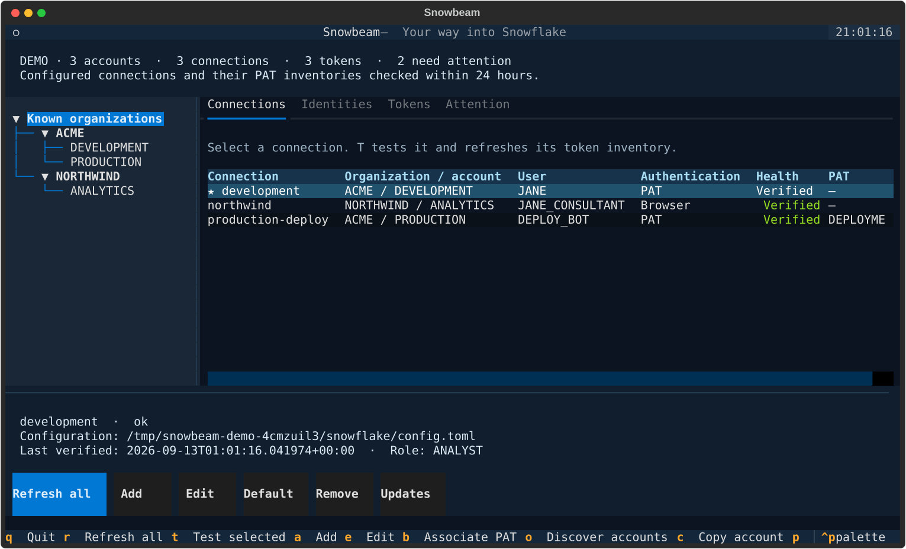

# Snowbeam

Your way into Snowflake.

Snowbeam is a small terminal app for Linux and macOS. Manage local Snowflake
connection profiles, keep a map of your organizations and accounts, and see
programmatic access token (PAT) expirations before they interrupt your work.

Independent of Airlock. Open source. MIT licensed.



## Try it

Requires Python 3.11 or newer and [uv](https://docs.astral.sh/uv/getting-started/installation/).

```sh
git clone https://github.com/reunionstudio/snowbeam.git
cd snowbeam
uv sync --frozen
uv run snowbeam --demo
```

The demo uses temporary, synthetic data. It does not read your Snowflake
configuration, connect to Snowflake, or enable desktop reminders.

For a persistent command available from any directory:

```sh
uv tool install .
uv tool install snowflake-cli
snowbeam
```

The GitHub repository is private. Snowbeam has not been released on PyPI.
Snowflake CLI must be available as `snow` for live refreshes. Offline inventory
and the demo work without it. You can select another executable with
`--snow-executable /absolute/path/to/snow`.

## Use it

The left tree filters the inventory by organization or account. Connections,
Tokens, and Attention have separate tabs. Use the mouse or Tab and arrow keys.
A terminal of 120 columns is comfortable; 80 × 24 works with scrolling.

| Key or control | Action |
| --- | --- |
| `a` / Add | Add a local connection profile |
| `e` / Edit | Edit the selected connection's settings |
| Default | Make the selected profile the Snowflake CLI default |
| Remove | Confirm removal of a local profile |
| `t` | Test the selected connection and refresh its current user's PAT inventory |
| `r` / Refresh all | Refresh every configured connection |
| `b` | Associate a listed PAT with the selected connection |
| `o` | Refresh the selected connection and discover organization accounts |
| `c` | Copy the verified organization-account identifier |
| `q` | Quit |

New profiles default to browser SSO. The editor also supports PAT and key-pair
authentication through credential **file paths**. Create and rotate credentials
with Snowflake's own tools, then point the connection at them. Existing password
and other authentication settings are preserved, but Snowbeam does not offer
password input. A login needing a terminal prompt should be completed with
Snowflake CLI first; browser SSO can open your browser during a manual refresh.

The app automatically refreshes PAT and key-pair connections on startup and
hourly while open. Browser sign-in requires an explicit refresh. For cached
inventory without automatic network activity, run:

```sh
snowbeam tui --offline
```

Expiry countdowns update locally every minute. A failed refresh retains the
last successful metadata and displays the failure. Checks older than 24 hours
are flagged as stale. An empty or unverified inventory is never reported as
proof that all tokens are safe.


## What the inventory means

A successful refresh records the authenticated organization, account name,
account locator, region, user, role, and warehouse. Snowbeam groups profiles
that resolve to the same account and retains known accounts locally.

PAT inspection covers the **current user of each configured connection**. It
is not an inventory of every user's tokens. The metadata command supplies names,
status, expiration, and role restrictions, not token values. Snowbeam cannot
infer which opaque token a profile uses: `b` records an explicit association.
See Snowflake's [PAT metadata reference](https://docs.snowflake.com/en/sql-reference/sql/show-user-programmatic-access-tokens).

Organization discovery is optional and subject to the current role's
privileges. It adds known accounts; it does not create connection profiles or
inspect users in those accounts. A denied discovery does not erase earlier
results. See Snowflake's [SHOW ACCOUNTS reference](https://docs.snowflake.com/en/sql-reference/sql/show-accounts).

Snowbeam does not create, rotate, revoke, or renew PATs. An expired PAT can
prevent refreshing its own inventory; use a working connection for the same
account and user to inspect it again. Local profile removal does not revoke a
credential or erase cached expiration records.

## Configuration and local storage

Snowbeam follows Snowflake CLI's configuration discovery: `SNOWFLAKE_HOME`,
then an existing `~/.snowflake` directory, then the platform's Snowflake config
directory. An adjacent `connections.toml` takes precedence over connection
tables in `config.toml`. Select an explicit file with:

```sh
snowbeam --snow-config /path/to/config.toml
```

Edits preserve comments and fields outside the editor. Each changed TOML file
gets a private `.snowbeam.bak` snapshot of its previous contents. Writes are
atomic, use mode `0600`, and reject symlinks and detected concurrent edits.
Environment overrides are reflected in inventory but are not changed by the
editor. Snowflake CLI's [configuration guide](https://docs.snowflake.com/en/developer-guide/snowflake-cli/connecting/configure-cli)
describes the underlying format and environment variables.

The metadata cache is `inventory.sqlite3` under:

- Linux: `$XDG_DATA_HOME/snowbeam`, normally `~/.local/share/snowbeam`.
- macOS: `~/Library/Application Support/snowbeam`.
- Either platform: a directory selected with `--state-dir /path/to/directory`.

The database stores account identifiers, usernames, selected connection
settings and credential paths, PAT metadata, check timestamps, and reminder
history. It does not store token values, passwords, or private keys. Existing
secrets remain in the original Snowflake configuration **and its backup** when
present. Snowflake CLI handles authentication and has its own logging settings.
The cache is private to the filesystem user, not encrypted. JSON exports also
contain identifiers and usernames.

There is no Snowbeam server, telemetry, or remote sync. Live checks run fixed
metadata SQL through the installed Snowflake CLI. Snowbeam does not query
business tables or change Snowflake objects.

## Linux and Omarchy

After a persistent installation, add Snowbeam to your application launcher:

```sh
snowbeam desktop install
```

This writes a standard `snowbeam.desktop` entry with `Terminal=true`. The desktop
must support launching terminal applications. No Omarchy configuration is
replaced. The launcher depends on the installed Python environment remaining in
place; reinstall it after moving or reinstalling Snowbeam.

## Optional desktop reminders

```sh
snowbeam reminders install
snowbeam reminders remove
```

Installation **enables** a per-user job: daily around 09:00 on Linux with systemd,
or hourly on macOS with launchd. It refreshes PAT/key-pair connections without
interactive sign-in, then checks cached expirations. It does not open SSO browser
windows. A scheduler's environment may lack credentials or variables exported
only in your shell; those refreshes remain visibly unverified.

Reminders are deduplicated at 14, 7, 3, and 1 day remaining, then at expiration.
Disabled tokens, unknown expirations, and verification gaps also need attention.
These are best-effort local reminders while your user session can run jobs;
they are not a hosted monitoring service. Linux needs `notify-send` and a desktop
notification service. macOS uses `osascript`; notification delivery also depends
on macOS settings. Reinstall the job after moving the Python environment.

## CLI and JSON

Global options go before the command. These commands use the same config and
cache as the terminal app:

```sh
snowbeam connections list --json
snowbeam connections add work --account MYORG-MYACCOUNT --user ME
snowbeam connections edit work --role ANALYST --warehouse COMPUTE_WH
snowbeam connections default work
snowbeam refresh work
snowbeam refresh work --organization
snowbeam connections bind-token work MY_PAT_NAME
snowbeam inventory --json
snowbeam tokens --json
snowbeam check --json
snowbeam check --refresh --notify
snowbeam connections remove work --yes
```

Pass an empty string to clear an editable setting or a PAT association.
`check` uses cached data unless `--refresh` is supplied. Exit codes:

| Code | Meaning |
| --- | --- |
| `0` | No alerts or verification issues within the configured scope |
| `1` | Token attention is due |
| `2` | Verification is incomplete or a command failed; alerts may also be present |

`--days` changes the check's upcoming-expiration window, which defaults to 14.
`refresh --non-interactive` skips interactive authentication. Inspect
`verification_issues` alongside `alerts` in JSON output.

## Development

```sh
uv sync --frozen
uv run ruff check src tests tools
uv run ruff format --check src tests tools
uv run pytest -q
uv build
uv run python tools/capture_demo.py
```

Tests cover config precedence and safe editing, metadata-only persistence,
account deduplication, stale/failed checks, expiry boundaries, token association,
CLI errors, notification deduplication, scheduler files, and terminal interaction.
CI is configured for Linux and macOS with Python 3.11 and 3.13. All test data is synthetic;
tests do not read local credentials or connect to Snowflake.

Initial validation used Snowflake CLI 3.17.1 for command/config compatibility.
Live Snowflake authentication and a real Omarchy desktop remain to be validated.
