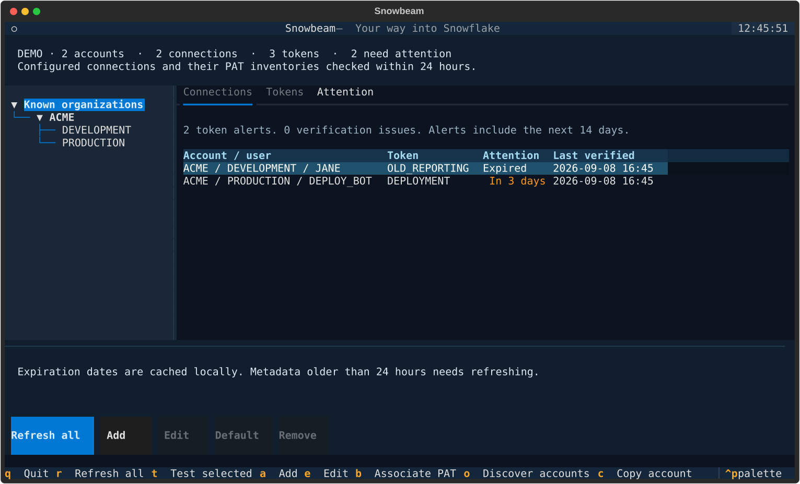
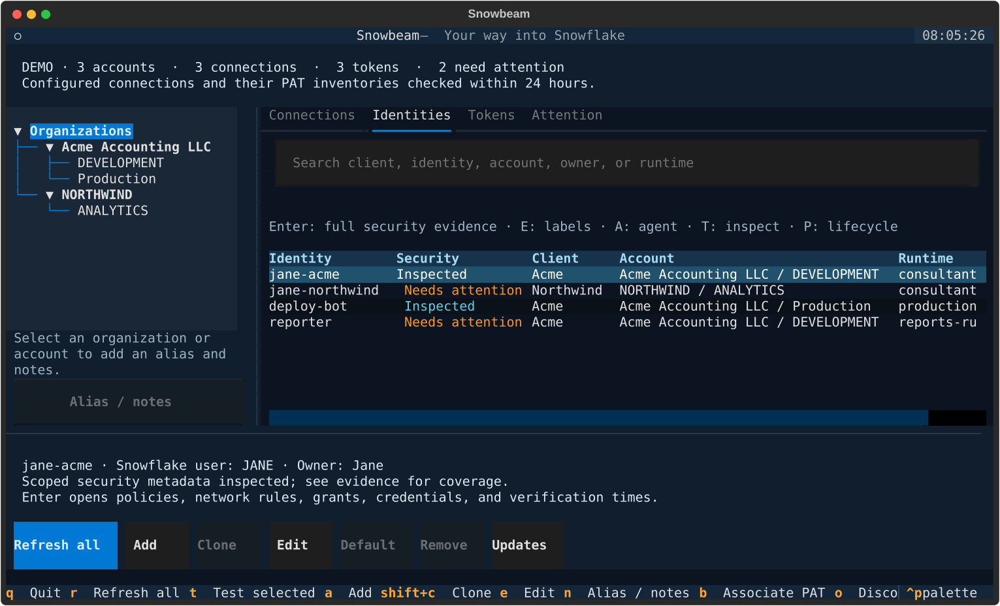
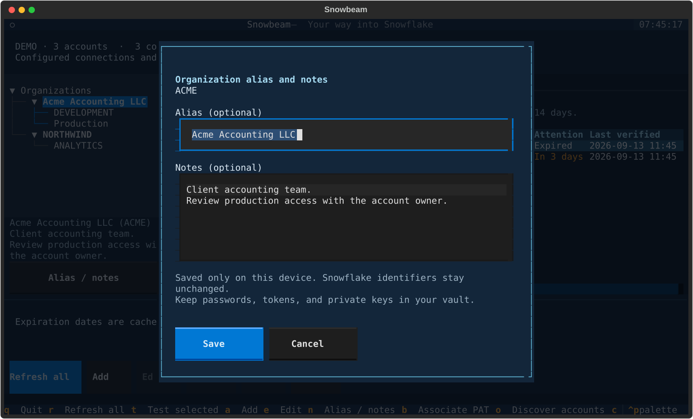

# Snowbeam user guide

[Project overview](../README.md) · [Identity and security guide](security.md)

## Terminal controls

The left tree filters the inventory by organization or account. Connections,
Identities, Tokens, and Attention have separate tabs. Use the mouse or Tab and arrow keys.
A terminal of 120 columns is comfortable; 80 × 24 works with scrolling.

| Key or control | Action |
| --- | --- |
| `a` / Add | Add a connection; on Identities, record a new agent from a template |
| `e` / Edit | Edit connection settings or identity labels |
| `n` / Alias / notes | Name and annotate the selected organization or account locally |
| Default | Make the selected profile the Snowflake CLI default |
| Remove | Confirm removal of a local profile |
| `t` | Test a connection; on Identities, inspect security metadata |
| `r` / Refresh all | Refresh every configured connection |
| `b` | Associate a listed PAT with the selected connection |
| `o` | Refresh the selected connection and discover organization accounts |
| `c` | Copy the verified organization-account identifier |
| Enter / `p` on Identities | Read full evidence / preview a managed agent lifecycle action |
| `q` | Quit |

New profiles default to browser SSO. The editor also supports PAT and key-pair
authentication through credential **file paths**, plus WIF provider selection.
For managed agents, Snowbeam can create and rotate credentials through an
account-bound plan and verified vault write. See the
[identity and security guide](security.md) for setup, authorization,
runtime handoff, and recovery. Existing password
and other authentication settings are preserved, but Snowbeam does not offer
password input. A login needing a terminal prompt should be completed with
Snowflake CLI first; browser SSO can open your browser during a manual refresh.

The app checks which eligible connections are due on startup and every minute
while open. Each connection refreshes hourly by default. PAT, key-pair, and
configured workload identities can support unattended authentication; vault access
also needs unattended authorization. Browser sign-in requires an explicit refresh. For cached
inventory without automatic network activity, run:

```sh
snowbeam tui --offline
```

Expiry countdowns update locally every minute. A failed refresh retains the
last successful metadata and displays the failure. Checks older than 24 hours
are flagged as stale. An empty or unverified inventory is never reported as
proof that all tokens are safe.

Set a connection's background interval in minutes (1–1440), or use 0 to disable it:

```sh
snowbeam refresh-policy
snowbeam refresh-policy work --minutes 120
snowbeam refresh-policy work --minutes 0
```

Preferences are scoped to the configuration path and connection name, so profiles
from different client configurations do not share settings. Choose intervals for
each connection to control polling of its account. Scheduled failures double the
interval up to 16 times the configured interval, capped at 24 hours. Success resets
the delay. Restarting the app retains the schedule. Changing a profile's account,
user, or other displayed settings clears its verification and schedule. Explicit
`refresh` and the app's manual Refresh/Test actions always attempt a check, even
when background refresh is disabled or delayed. Scheduled reminders respect the
same intervals, but only run as often as the installed OS job.

Ordinary refresh authenticates as each connection's configured user. A successful
operator inspection does not prove an agent can authenticate. For unattended
account-wide inspection, configure an appropriately limited monitoring identity
and authorized inspection template; Snowbeam does not automatically create or
switch to an administrative monitoring login. Credential changes always require
the existing plan/apply flow.

The Updates panel (`u`) is separate from Snowflake refresh. See
[installation and updates](macos.md) for explicit checks and optional daily checks.



## Consultant and agent inventory

Search Identities by client, organization, account, alias, user, owner, or runtime.
Label existing profiles, inspect their policies, and use account-bound templates
for new agents. Missing or stale evidence stays visible. Policy contents and
direct role-grant changes are compared with the approved setup.

```sh
snowbeam identities track acme-jane --connection work --client Acme --owner Jane
snowbeam identities refresh acme-jane
snowbeam identities list --client Acme --json
```



The [identity and security guide](security.md) covers individual PAT/key/WIF
setup, vault references, reviewed plan/apply, runtime tests, rotation, revocation,
and the boundary between a connection catalog and actual access isolation.

## Organization and account aliases

Select an organization or account in the left tree, then click **Alias / notes**
or press `n`. Enter a friendly name and any local notes, then **Save**. For example,
organization `FLXH5C4T` can appear as **Acme Accounting LLC**. Accounts have their
own aliases and notes. Leave a field empty to clear it; Escape cancels the edit.

The tree and tables use the friendly names. The selected tree item's caption,
connection/token details, and alias editor retain the real identifiers. Copying
an account with `c` always copies the verified Snowflake identifier. Aliases do
not rename Snowflake objects, change connection settings, or affect permissions.
Identity search matches aliases as well as identifiers.

These commands read or edit the same local records without connecting to Snowflake:

```sh
snowbeam labels organization FLXH5C4T --alias "Acme Accounting LLC"
snowbeam labels organization FLXH5C4T --notes "Client accounting team."
snowbeam labels account FLXH5C4T-PROD --alias "Finance production"
snowbeam labels account FLXH5C4T-PROD --json
```

Use identifiers from your known inventory. If an account identifier is ambiguous,
use its exact `id` from `snowbeam inventory --json`. Omitted flags preserve the
existing field; `--alias ""` or `--notes ""` clears it. Aliases allow 120 characters;
notes allow 8,000 characters, including multiple lines. Keep credentials in your
vault, never in notes.

Aliases and notes persist across refreshes, restarts, and package upgrades in
`inventory.sqlite3`. Account annotations follow the existing local account ID
when a refresh recognizes an account rename by locator and region. Organization
annotations belong to the exact organization identifier; Snowbeam does not guess
that a renamed organization is the same one. They are local to this state
directory and are not synced to another device. Back up the database with your
local state: deleting it also deletes these annotations.



## What the inventory means

A successful refresh records the authenticated organization, account name,
account locator, region, user, role, and warehouse. Snowbeam groups profiles
that resolve to the same account and retains known accounts locally.

Connection refresh inspects the **current user of each configured connection**.
Identity inspection can also use a template's authorized administrative
connection to inspect that managed agent. This is a scoped inventory, not
automatic discovery of every user's tokens. The metadata command supplies names,
status, expiration, and role restrictions, not token values. Snowbeam cannot
infer which opaque token a profile uses: `b` records an explicit association.
See Snowflake's [PAT metadata reference](https://docs.snowflake.com/en/sql-reference/sql/show-user-programmatic-access-tokens).

Organization discovery is optional and subject to the current role's
privileges. It adds known accounts; it does not create connection profiles or
inspect users in those accounts. A denied discovery does not erase earlier
results. See Snowflake's [SHOW ACCOUNTS reference](https://docs.snowflake.com/en/sql-reference/sql/show-accounts).

Managed-agent lifecycle commands create, rotate, and revoke individual
credentials only after plan review. Ordinary refreshes never mutate Snowflake.
An expired PAT can prevent refreshing its own connection; inspect a managed
agent through its authorized administrative connection. Local profile removal
does not revoke a credential or erase cached expiration records.

## Configuration and local storage

Snowbeam follows Snowflake CLI's configuration discovery: `SNOWFLAKE_HOME`,
then an existing `~/.snowflake` directory, then the platform's Snowflake config
directory. An adjacent `connections.toml` takes precedence over connection
tables in `config.toml`. Select an explicit file with:

```sh
snowbeam --snow-config /path/to/config.toml
```

Edits preserve comments and fields outside the editor. Each changed TOML file
gets a private `.snowbeam.bak` snapshot of its previous contents. Writes are
atomic, use mode `0600`, and reject symlinks and detected concurrent edits.
Environment overrides are reflected in inventory but are not changed by the
editor. Snowflake CLI's [configuration guide](https://docs.snowflake.com/en/developer-guide/snowflake-cli/connecting/configure-cli)
describes the underlying format and environment variables.

The local inventory and annotations are in `inventory.sqlite3` under:

- Linux: `$XDG_DATA_HOME/snowbeam`, normally `~/.local/share/snowbeam`.
- macOS: `~/Library/Application Support/snowbeam`.
- Either platform: a directory selected with `--state-dir /path/to/directory`.

The database stores account identifiers, usernames, selected connection
settings and credential paths, policy/grant evidence, PAT metadata, vault
references, lifecycle journals, check timestamps, reminder history, and your
organization/account aliases and notes. It does
not store token values, passwords, or private keys. Existing
secrets remain in the original Snowflake configuration **and its backup** when
present. Snowflake CLI handles authentication and has its own logging settings.
The cache is private to the filesystem user, not encrypted. JSON exports also
contain identifiers and usernames; `inventory --json` also includes aliases and notes
as separate fields on account records. The original identifier fields remain unchanged.

The same directory holds `preferences.toml` (refresh intervals and the optional
update-check preference) and `updates.json` (public release versions and check
timestamps). These contain no credential values.

There is no Snowbeam server, telemetry, or remote sync. Live checks run fixed
metadata SQL through the installed Snowflake CLI. Reviewed lifecycle commands
change the specified agent's Snowflake user and credentials. The runtime `exec`
bridge runs the command you supply with that identity. Neither connection names
nor temporary child environments provide operating-system isolation.

## Omarchy first

See [Omarchy and Linux installation and updates](omarchy.md) for the current uv
route and the planned AUR distribution.

After a persistent installation, add Snowbeam and its pixel transporter icon to your
application launcher:

```sh
snowbeam desktop install
```

This installs the bundled pixel PNG icon and writes a standard
`snowbeam.desktop` entry with `Terminal=true`. The desktop
must support launching terminal applications. No Omarchy configuration is
replaced. The launcher depends on the installed Python environment remaining in
place; reinstall it after moving or reinstalling Snowbeam.

Omarchy also supports **Install → TUI** in its `Super + Space` menu: use the name
`Snowbeam`, launch command `snowbeam`, your preferred window style, and the bundled
[launcher icon](../src/snowbeam/assets/snowbeam-512.png). Use either that flow or
`snowbeam desktop install`. See the [Omarchy TUI manual](https://omarchy.org/manual/tuis/#adding-your-own).

The [pixel logo](https://github.com/reunionstudio/snowbeam/blob/main/docs/brand/README.md) is supplied in launcher sizes from 16 to
512 pixels, with the original generated source and prompts preserved. After
updating Snowbeam, run `snowbeam desktop install` again to refresh an existing
launcher icon. Opening the app is immediate.

## Optional desktop reminders

```sh
snowbeam reminders install
snowbeam reminders remove
```

Installation **enables** a per-user job: daily around 09:00 on Linux with systemd,
or hourly on macOS with launchd. It refreshes PAT/key-pair connections without
interactive sign-in, then checks cached expirations. It does not open SSO browser
windows. A scheduler's environment may lack credentials or variables exported
only in your shell; those refreshes remain visibly unverified.

Reminders are deduplicated at 14, 7, 3, and 1 day remaining, then at expiration.
Disabled tokens, unknown expirations, and verification gaps also need attention.
These are best-effort local reminders while your user session can run jobs;
they are not a hosted monitoring service. Linux needs `notify-send` and a desktop
notification service. macOS uses `osascript`; notification delivery also depends
on macOS settings. Reinstall the job after moving the Python environment.

## CLI and JSON

Global options go before the command. These commands use the same config and
cache as the terminal app:

```sh
snowbeam connections list --json
snowbeam connections add work --account MYORG-MYACCOUNT --user ME
snowbeam connections edit work --role ANALYST --warehouse COMPUTE_WH
snowbeam connections default work
snowbeam refresh work
snowbeam refresh work --organization
snowbeam connections bind-token work MY_PAT_NAME
snowbeam inventory --json
snowbeam tokens --json
snowbeam check --json
snowbeam check --refresh --notify
snowbeam connections remove work --yes
```

Pass an empty string to clear an editable setting or a PAT association.
`check` uses cached data unless `--refresh` is supplied. Exit codes:

| Code | Meaning |
| --- | --- |
| `0` | No alerts or verification issues within the configured scope |
| `1` | Token attention is due |
| `2` | Verification is incomplete or a command failed; alerts may also be present |

`--days` changes the check's upcoming-expiration window, which defaults to 14.
`refresh --non-interactive` skips interactive authentication. Inspect
`verification_issues` alongside `alerts` in JSON output. `check --refresh` updates
connection/PAT checks; use `identities refresh` to update policy evidence.
Background refresh resolves 1Password references only with an authorized service
account; other vault access needs explicit refresh. No background job provisions
or rotates an identity.
